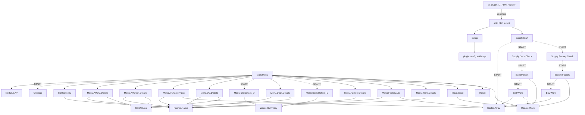

```mermaid
graph TD
  al_LI_FDN_event[al.LI.FDN.event] --> plugin_LI_FDN_Setup[Setup]
  al_LI_FDN_event[al.LI.FDN.event] --> plugin_LI_FDN_Supply_Start[Supply.Start]
  plugin_LI_FDN_Buy_Ware[Buy.Ware] --> plugin_LI_FDN_Sector_Array[Sector.Array]
  plugin_LI_FDN_Config_Menu[Config.Menu] --> plugin_LI_FDN_Format_Name[Format.Name]
  plugin_LI_FDN_Main_Menu[Main.Menu] --> lib_BW_isAP[lib.BW.isAP]
  plugin_LI_FDN_Main_Menu[Main.Menu] -.->|START| plugin_LI_FDN_Cleanup[Cleanup]
  plugin_LI_FDN_Main_Menu[Main.Menu] --> plugin_LI_FDN_Config_Menu[Config.Menu]
  plugin_LI_FDN_Main_Menu[Main.Menu] --> plugin_LI_FDN_Menu_AP_DC_Details[Menu.AP.DC.Details]
  plugin_LI_FDN_Main_Menu[Main.Menu] --> plugin_LI_FDN_Menu_AP_Dock_Details[Menu.AP.Dock.Details]
  plugin_LI_FDN_Main_Menu[Main.Menu] --> plugin_LI_FDN_Menu_AP_Factory_List[Menu.AP.Factory.List]
  plugin_LI_FDN_Main_Menu[Main.Menu] --> plugin_LI_FDN_Menu_DC_Details[Menu.DC.Details]
  plugin_LI_FDN_Main_Menu[Main.Menu] -.->|START| plugin_LI_FDN_Menu_DC_Details_D[Menu.DC.Details_D]
  plugin_LI_FDN_Main_Menu[Main.Menu] --> plugin_LI_FDN_Menu_Dock_Details[Menu.Dock.Details]
  plugin_LI_FDN_Main_Menu[Main.Menu] -.->|START| plugin_LI_FDN_Menu_Dock_Details_D[Menu.Dock.Details_D]
  plugin_LI_FDN_Main_Menu[Main.Menu] --> plugin_LI_FDN_Menu_Factory_Details[Menu.Factory.Details]
  plugin_LI_FDN_Main_Menu[Main.Menu] --> plugin_LI_FDN_Menu_Factory_List[Menu.Factory.List]
  plugin_LI_FDN_Main_Menu[Main.Menu] --> plugin_LI_FDN_Menu_Ware_Details[Menu.Ware.Details]
  plugin_LI_FDN_Main_Menu[Main.Menu] --> plugin_LI_FDN_Move_Ware[Move.Ware]
  plugin_LI_FDN_Main_Menu[Main.Menu] --> plugin_LI_FDN_Reset[Reset]
  plugin_LI_FDN_Main_Menu[Main.Menu] --> plugin_LI_FDN_Update_Ware[Update.Ware]
  plugin_LI_FDN_Menu_AP_DC_Details[Menu.AP.DC.Details] --> plugin_LI_FDN_Format_Name[Format.Name]
  plugin_LI_FDN_Menu_AP_DC_Details[Menu.AP.DC.Details] --> plugin_LI_FDN_Sort_Wares[Sort.Wares]
  plugin_LI_FDN_Menu_AP_Dock_Details[Menu.AP.Dock.Details] --> plugin_LI_FDN_Format_Name[Format.Name]
  plugin_LI_FDN_Menu_AP_Dock_Details[Menu.AP.Dock.Details] --> plugin_LI_FDN_Sort_Wares[Sort.Wares]
  plugin_LI_FDN_Menu_AP_Factory_List[Menu.AP.Factory.List] --> plugin_LI_FDN_Format_Name[Format.Name]
  plugin_LI_FDN_Menu_AP_Factory_List[Menu.AP.Factory.List] --> plugin_LI_FDN_Sector_Array[Sector.Array]
  plugin_LI_FDN_Menu_DC_Details[Menu.DC.Details] --> plugin_LI_FDN_Format_Name[Format.Name]
  plugin_LI_FDN_Menu_DC_Details[Menu.DC.Details] --> plugin_LI_FDN_Sort_Wares[Sort.Wares]
  plugin_LI_FDN_Menu_DC_Details_D[Menu.DC.Details_D] --> plugin_LI_FDN_Wares_Summary[Wares.Summary]
  plugin_LI_FDN_Menu_Dock_Details[Menu.Dock.Details] --> plugin_LI_FDN_Format_Name[Format.Name]
  plugin_LI_FDN_Menu_Dock_Details[Menu.Dock.Details] --> plugin_LI_FDN_Sort_Wares[Sort.Wares]
  plugin_LI_FDN_Menu_Dock_Details_D[Menu.Dock.Details_D] --> plugin_LI_FDN_Wares_Summary[Wares.Summary]
  plugin_LI_FDN_Menu_Factory_Details[Menu.Factory.Details] --> plugin_LI_FDN_Format_Name[Format.Name]
  plugin_LI_FDN_Menu_Factory_List[Menu.Factory.List] --> plugin_LI_FDN_Format_Name[Format.Name]
  plugin_LI_FDN_Menu_Factory_List[Menu.Factory.List] --> plugin_LI_FDN_Sector_Array[Sector.Array]
  plugin_LI_FDN_Menu_Ware_Details[Menu.Ware.Details] --> plugin_LI_FDN_Format_Name[Format.Name]
  plugin_LI_FDN_Move_Ware[Move.Ware] --> plugin_LI_FDN_Update_Ware[Update.Ware]
  plugin_LI_FDN_Sell_Ware[Sell.Ware] --> plugin_LI_FDN_Sector_Array[Sector.Array]
  plugin_LI_FDN_Sell_Ware[Sell.Ware] --> plugin_LI_FDN_Update_Ware[Update.Ware]
  plugin_LI_FDN_Setup[Setup] --> plugin_config_addscript[plugin.config.addscript]
  plugin_LI_FDN_Supply_Dock_Check[Supply.Dock.Check] -.->|START| plugin_LI_FDN_Supply_Dock[Supply.Dock]
  plugin_LI_FDN_Supply_Dock[Supply.Dock] -.->|START| plugin_LI_FDN_Sell_Ware[Sell.Ware]
  plugin_LI_FDN_Supply_Dock[Supply.Dock] --> plugin_LI_FDN_Update_Ware[Update.Ware]
  plugin_LI_FDN_Supply_Factory_Check[Supply.Factory.Check] -.->|START| plugin_LI_FDN_Supply_Factory[Supply.Factory]
  plugin_LI_FDN_Supply_Factory[Supply.Factory] -.->|START| plugin_LI_FDN_Buy_Ware[Buy.Ware]
  plugin_LI_FDN_Supply_Factory[Supply.Factory] --> plugin_LI_FDN_Update_Ware[Update.Ware]
  plugin_LI_FDN_Supply_Start[Supply.Start] -.->|START| plugin_LI_FDN_Sector_Array[Sector.Array]
  plugin_LI_FDN_Supply_Start[Supply.Start] -.->|START| plugin_LI_FDN_Supply_Dock_Check[Supply.Dock.Check]
  plugin_LI_FDN_Supply_Start[Supply.Start] -.->|START| plugin_LI_FDN_Supply_Factory_Check[Supply.Factory.Check]
  al_plugin_LI_FDN_register -->|registers| al_LI_FDN_event
```
